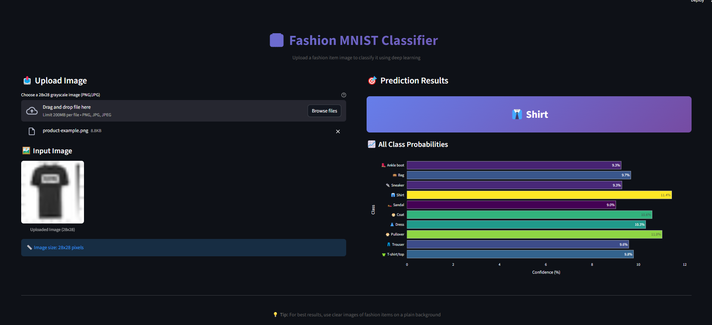

# Fashion MNIST Classifier

Ce projet est une application de classification d’images d’articles de mode à l’aide d’un réseau de neurones artificiels (ANN) entraîné sur le dataset **Fashion MNIST**.  
L’interface utilisateur a été développée avec **Streamlit** pour une démonstration interactive.

---

## Aperçu



---

##  Fonctionnalités

-  Upload d’une image 28x28 (format PNG/JPG)
-  Prédiction de la classe (Shirt, Sneaker, Coat, etc.)
-  Affichage des probabilités de toutes les classes
-  Interface moderne en thème sombre

---

##  Modèle

- Réseau de neurones avec Keras/TensorFlow
- Fonction d’activation : ReLU & Softmax
- Entraînement sur le dataset Fashion-MNIST
- Courbes de loss/accuracy traquées à chaque epoch

---

##  Lancer l'application

```bash
git clone https://github.com/eyaguirat10/deep-learning-fashion-mnist.git
cd deep-learning-fashion-mnist
python -m venv venv
source venv/bin/activate  # sous Linux/macOS
venv\Scripts\activate     # sous Windows

pip install -r requirements.txt
streamlit run app.py
